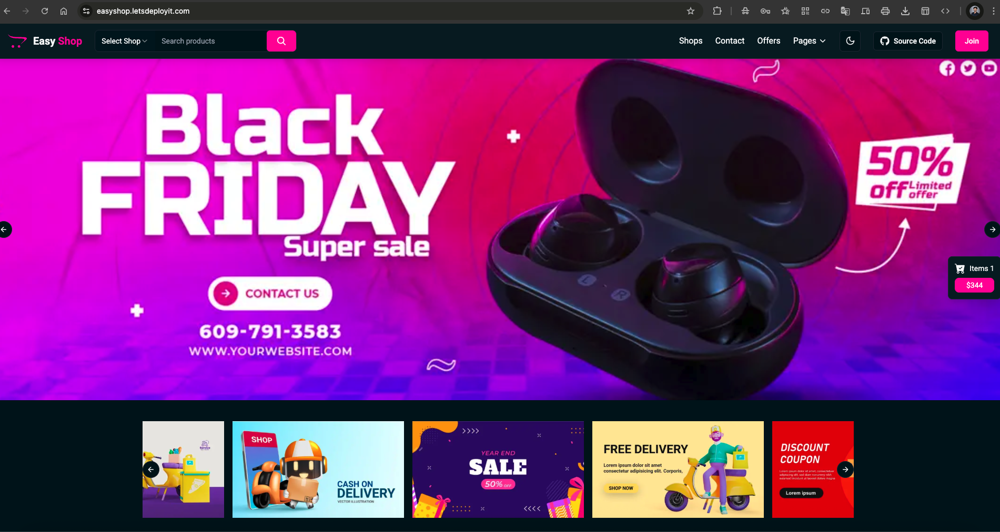

# 🛍️ EasyShop - Modern E-commerce Platform

[](https://nextjs.org/)
[](https://www.typescriptlang.org/)
[](https://www.mongodb.com/)
[](https://redux.js.org/)
[](LICENSE)

EasyShop is a modern, full-stack e-commerce platform built with Next.js 14, TypeScript, and MongoDB. It features a beautiful UI with Tailwind CSS, secure authentication, real-time cart updates, and a seamless shopping experience.

## ✨ Features

- 🎨 Modern and responsive UI with dark mode support
- 🔐 Secure JWT-based authentication
- 🛒 Real-time cart management with Redux
- 📱 Mobile-first design approach
- 🔍 Advanced product search and filtering
- 💳 Secure checkout process
- 📦 Multiple product categories
- 👤 User profiles and order history
- 🌙 Dark/Light theme support

## 🏗️ Architecture

EasyShop follows a three-tier architecture pattern:

### 1. Presentation Tier (Frontend)
- Next.js React Components
- Redux for State Management
- Tailwind CSS for Styling
- Client-side Routing
- Responsive UI Components

### 2. Application Tier (Backend)
- Next.js API Routes
- Business Logic
- Authentication & Authorization
- Request Validation
- Error Handling
- Data Processing

### 3. Data Tier (Database)
- MongoDB Database
- Mongoose ODM
- Data Models
- CRUD Operations
- Data Validation

## PreRequisites

> [!IMPORTANT]  
> Before you begin setting up this project, make sure the following tools are installed and configured properly on your system:

## Setup & Initialization <br/>

### 1. Install Terraform
* Install Terraform<br/>
#### Linux & macOS
```bash
curl -fsSL https://apt.releases.hashicorp.com/gpg | sudo apt-key add -
sudo apt-add-repository "deb [arch=amd64] https://apt.releases.hashicorp.com $(lsb_release -cs) main"
sudo apt-get update && sudo apt-get install terraform
```
### Verify Installation
```bash
terraform -v
```
### Initialize Terraform
```bash
terraform init
```
### 2. Install AWS CLI
AWS CLI (Command Line Interface) allows you to interact with AWS services directly from the command line.

```bash
curl "https://awscli.amazonaws.com/awscli-exe-linux-x86_64.zip" -o "awscliv2.zip"
sudo apt install unzip
unzip awscliv2.zip
sudo ./aws/install
```

 ```aws configure```

> #### This will prompt you to enter:<br/>
- **AWS Access Key ID:**<br/>
- **AWS Secret Access Key:**<br/>
- **Default region name:**<br/>
- **Default output format:**<br/>

> [!NOTE] 
> Make sure the IAM user you're using has the necessary permissions. You’ll need an AWS IAM Role with programmatic access enabled, along with the Access Key and Secret Key.

## Getting Started

> Follow the steps below to get your infrastructure up and running using Terraform:<br/>

1. **Clone the Repository:**
First, clone this repo to your local machine:<br/>
```bash
git clone https://github.com/LondheShubham153/tws-e-commerce-app.git
cd terraform
```
2. **Generate SSH Key Pair:**
Create a new SSH key to access your EC2 instance:
```bash
ssh-keygen -f terra-key
```
This will prompt you to create a new key file named terra-key.

3. **Private key permission:** Change your private key permission:
```bash
chmod 400 terra-key
```

4. **Initialize Terraform:**
Initialize the Terraform working directory to download required providers:
```bash
terraform init
```
5. **Review the Execution Plan:**
Before applying changes, always check the execution plan:
```bash
terraform plan
```
6. **Apply the Configuration:**
Now, apply the changes and create the infrastructure:
```bash
terraform apply
```
> Confirm with `yes` when prompted.

7. **Access Your EC2 Instance;** <br/>
After deployment, grab the public IP of your EC2 instance from the output or AWS Console, then connect using SSH:
```bash
ssh -i terra-key ubuntu@<public-ip>
```
8. **Update your kubeconfig:**
wherever you want to access your eks wheather it is yur local machine or bastion server this command will help you to interact with your eks.
> [!CAUTION]
> you need to configure aws cli first to execute this command:

```bash
aws configure
```

```bash
aws eks --region eu-west-1 update-kubeconfig --name tws-eks-cluster
```
9. **Check your cluster:**
```bash
kubectl get nodes
```

## Jenkins Setup Steps
> [!TIP]
> Check if jenkins service is running:

```bash
sudo systemctl status jenkins
```
## Steps to Access Jenkins & Install Plugins

#### 1. **Open Jenkins in Browser:**
> Use your public IP with port 8080:
>**http://<public_IP>:8080**

#### 2. **Initial Admin password:**
> Start the service and get the Jenkins initial admin password:
> ```bash
> sudo cat /var/lib/jenkins/secrets/initialAdminPassword
> ```

#### 3. **Start Jenkins (*If Not Running*):**
> Get the Jenkins initial admin password:
> ```bash
> sudo systemctl enable jenkins
> sudo systemctl restart jenkins
> ```
#### 4. **Install Essential Plugins:**
> - Navigate to:
> **Manage Jenkins → Plugins → Available Plugins**<br/>
> - Search and install the following:<br/>
>   - **Docker Pipeline**<br/>
>   - **Pipeline View**


#### 5. **Set Up Docker & GitHub Credentials in Jenkins (Global Credentials)**<br/>
>
> - GitHub Credentials:
>   - Go to:
**Jenkins → Manage Jenkins → Credentials → (Global) → Add Credentials**
> - Use:
>   - Kind: **Username with password**
>   - ID: **github-credentials**<br/>


> - DockerHub Credentials:
> Go to the same Global Credentials section
> - Use:
>   - Kind: **Username with password**
>   - ID: **docker-hub-credentials**
> [Notes:]
> Use these IDs in your Jenkins pipeline for secure access to GitHub and DockerHub

#### 6. Jenkins Shared Library Setup:
> - `Configure Trusted Pipeline Library`:
>   - Go to:
> **Jenkins → Manage Jenkins → Configure System**
> Scroll to Global Pipeline Libraries section
>
> - **Add a New Shared Library:** 
> - **Name:** shared
> - **Default Version:** main
> - **Project Repository URL:** `https://github.com/<your user-name/jenkins-shared-libraries`.
>
> [Notes:] 
> Make sure the repo contains a proper directory structure eq: vars/<br/>
	
#### 7. Setup Pipeline<br/>
> - Create New Pipeline Job<br/>
>   - **Name:** EasyShop<br/>
>   - **Type:** Pipeline<br/>
> Press `Okey`<br/>

> > In **General**<br/>
> > - **Description:** EasyShop<br/>
> > - **Check the box:** `GitHub project`<br/>
> > - **GitHub Repo URL:** `https://github.com/<your user-name/tws-e-commerce-app`<br/>
>
> > In **Trigger**<br/>
> > - **Check the box:**`GitHub hook trigger for GITScm polling`<br/>
>
> > In **Pipeline**<br/>
> > - **Definition:** `Pipeline script from SCM`<br/>
> > - **SCM:** `Git`<br/>
> > - **Repository URL:** `https://github.com/<your user-name/tws-e-commerce-app`<br/>
> > - **Credentials:** `github-credentials`<br/>
> > - **Branch:** master<br/>
> > - **Script Path:** `Jenkinsfile`<br/>

#### **Fork Required Repos**<br/>
> > Fork App Repo:<br/>
> > * Open the `Jenkinsfile`<br/>
> > * Change the DockerHub username to yours<br/>
>
> > **Fork Shared Library Repo:**<br/>
> > * Edit `vars/update_k8s_manifest.groovy`<br/>
> > * Update with your `DockerHub username`<br/>
> 
> > **Setup Webhook**<br/>
> > In GitHub:<br/>
> >  * Go to **`Settings` → `Webhooks`**<br/>
> >  * Add a new webhook pointing to your Jenkins URL<br/>
> >  * Select: **`GitHub hook trigger for GITScm polling`** in Jenkins job<br/>
>
> > **Trigger the Pipeline**<br/>
> > Click **`Build Now`** in Jenkins

#### **8. CD – Continuous Deployment Setup**<br/>
**Prerequisites:**<br/>
Before configuring CD, make sure the following tools are installed:<br/>
* Installations Required:<br/>
**kubectl**<br/>
**AWS CLI**

**SSH into Bastion Server**<br/>
* Connect to your Bastion EC2 instance via SSH.

**Note:**<br/>
This is not the node where Jenkins is running. This is the intermediate EC2 (Bastion Host) used for accessing private resources like your EKS cluster.

**8. Configure AWS CLI on Bastion Server**
Run the AWS configure command:<br/>
```bash
aws configure
```
Add your Access Key and Secret Key when prompted.

**9. Update Kubeconfig for EKS**<br/>
Run the following important command:
```bash
aws eks update-kubeconfig --region eu-west-1 --name tws-eks-cluster
```
* This command maps your EKS cluster with your Bastion server.
* It helps to communicate with EKS components.

**10. Argo CD Setup**<br/>
Create a Namespace for Argo CD<br/>
```bash
kubectl create namespace argocd
```
1. Install Argo CD using Manifest
```bash
kubectl apply -n argocd -f https://raw.githubusercontent.com/argoproj/argo-cd/stable/manifests/install.yaml
```
2. Watch Pod Creation
```bash
watch kubectl get pods -n argocd
```
3. This helps monitor when all Argo CD pods are up and running.<br/>

4. Check Argo CD Services
```bash
kubectl get svc -n argocd
```

5. Change Argo CD Server Service to NodePort
```bash
kubectl patch svc argocd-server -n argocd -p '{"spec": {"type": "NodePort"}}'
```

11. Access Argo CD GUI<br/>
Check Argo CD Server Port (again, post NodePort change)<br/>
```bash
kubectl get svc -n argocd
```
1. Port Forward to Access Argo CD in Browser<br/>
 Forward Argo CD service to access the GUI:
```bash
kubectl port-forward svc/argocd-server -n argocd <your-port>:443 --address=0.0.0.0 &
```
2. Replace <your-port> with a local port of your choice (e.g., 8080).<br/>
 Now, open https://<bastion-ip>:<your-port> in your browser.


Get the Argo CD Admin Password<br/>
```bash
kubectl -n argocd get secret argocd-initial-admin-secret -o jsonpath="{.data.password}" | base64 -d; echo
```
1. Log in to the Argo CD GUI
* Username: admin
* Password: (Use the decoded password from the previous command)

2. Update Your Password
* On the left panel of Argo CD GUI, click on "User Info"
* Select Update Password and change it.

### **Deploy Your Application in Argo CD GUI**<br/>

> 1. On the Argo CD homepage, click on the “New App” button.<br/>

> 2. Fill in the following details:<br/>
>  -  **Application Name:**
> `Enter your desired app name`
>  -  **Project Name:**
> Select `default` from the dropdown.
>    * **Sync Policy:**
> Choose `Automatic`.

> 3. In the `Source` section:
> - **Repo URL:**
> Add the Git repository URL that contains your Kubernetes manifests.
> - **Path:** 
 `Kubernetes` (or the actual path inside the repo where your manifests reside)

> 4. In the “Destination” section:
>  -  **Cluster URL:**
 https://kubernetes.default.svc (usually shown as "default")
>  -    **Namespace:**
 tws-e-commerce-app (or your desired namespace)

> 5. Click on “Create”.

## Nginx ingress controller:<br/>
> 1. Install the Nginx Ingress Controller using Helm:
```bash
kubectl create namespace ingress-nginx
```
> 2. Add the Nginx Ingress Controller Helm repository:
```bash
helm repo add ingress-nginx https://kubernetes.github.io/ingress-nginx
helm repo update
```
> 3. Install the Nginx Ingress Controller:
```bash
helm install nginx-ingress ingress-nginx/ingress-nginx \
  --namespace ingress-nginx \
  --set controller.service.type=LoadBalancer
```
> 4. Check the status of the Nginx Ingress Controller:
```bash
kubectl get pods -n ingress-nginx
```
> 5. Get the external IP address of the LoadBalancer service:
```bash
kubectl get svc -n ingress-nginx
```

## Install Cert-Manager

> 1. **Jetpack:** Add the Jetstack Helm repository:
```bash
helm repo add jetstack https://charts.jetstack.io
helm repo update
```
> 2. **Cert-Manager:** Install the Cert-Manager Helm chart:
```bash
helm install cert-manager jetstack/cert-manager \
  --namespace cert-manager \
  --create-namespace \
  --version v1.12.0 \
  --set installCRDs=true
``` 
> 3. **Check pods:**Check the status of the Cert-Manager pods:
```bash
kubectl get pods -n cert-manager
```

> 4. **DNS Setup:** Find your DNS name from the LoadBalancer service:
```bash
kubectl get svc nginx-ingress-ingress-nginx-controller -n ingress-nginx -o jsonpath='{.status.loadBalancer.ingress[0].hostname}'
```
> 5. Create a DNS record for your domain pointing to the LoadBalancer IP.
> - Go to your godaddy dashboard and create a new CNAME record and map the DNS just your got in the terminal.


### **HTTPS:**
> #### 1. **Update your manifests to enable HTTPS:**
> > `04-configmap.yaml`
> > ```bash
> > apiVersion: v1
> > kind: ConfigMap
> > metadata:
> >   name: easyshop-config
> >   namespace: easyshop
> > data:
> >   MONGODB_URI: "mongodb://mongodb-service:27017/easyshop"
> >   NODE_ENV: "production"
> >   NEXT_PUBLIC_API_URL: "https://easyshop.letsdeployit.com/api"
> >   NEXTAUTH_URL: "https://easyshop.letsdeployit.com/"
> >   NEXTAUTH_SECRET: "HmaFjYZ2jbUK7Ef+wZrBiJei4ZNGBAJ5IdiOGAyQegw="
> >   JWT_SECRET: "e5e425764a34a2117ec2028bd53d6f1388e7b90aeae9fa7735f2469ea3a6cc8c"
> > ```

> #### 2. **Update your manifests to enable HTTPS:**
> > `10-ingress.yaml`
> > ```bash
> > apiVersion: networking.k8s.io/v1
> > kind: Ingress
> > metadata:
> >   name: easyshop-ingress
> >   namespace: easyshop
> >   annotations:
> >     nginx.ingress.kubernetes.io/proxy-body-size: "50m"
> >     kubernetes.io/ingress.class: "nginx"
> >     cert-manager.io/cluster-issuer: "letsencrypt-prod"
> >     nginx.ingress.kubernetes.io/ssl-redirect: "true"
> > spec:
> >   tls:
> >   - hosts:
> >     - easyshop.letsdeployit.com
> >     secretName: easyshop-tls
> >   rules:
> >   - host: easyshop.letsdeployit.com
> >     http:
> >       paths:
> >       - path: /
> >         pathType: Prefix
> >         backend:
> >           service:
> >             name: easyshop-service
> >             port:
> >               number: 80
> > ```

> #### 3. **Apply your manifests:**
> ```bash
> kubectl apply -f 00-cluster-issuer.yaml
> kubectl apply -f 04-configmap.yaml
> kubectl apply -f 10-ingress.yaml
> ```

> #### 4. **Commands to check the status:**
>
>> ```bash
>> kubectl get certificate -n easyshop
>> ```

>> ```bash
>> kubectl describe certificate easyshop-tls -n easyshop
>> ```
>
>> ```bash
>> kubectl logs -n cert-manager -l app=cert-manager
>> ```
>
>> ```bash
>> kubectl get challenges -n easyshop
>> ```
>
>> ```bash
>> kubectl describe challenges -n easyshop
>> ```

## **Congratulations!** <br/>


### Your project is now deployed.
